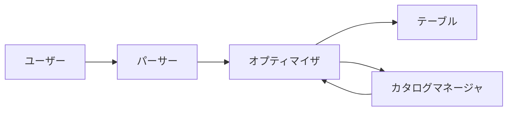
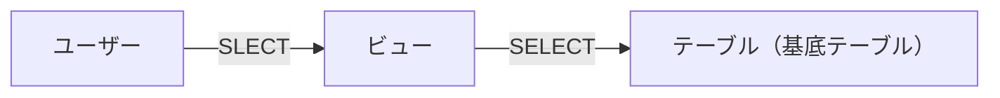
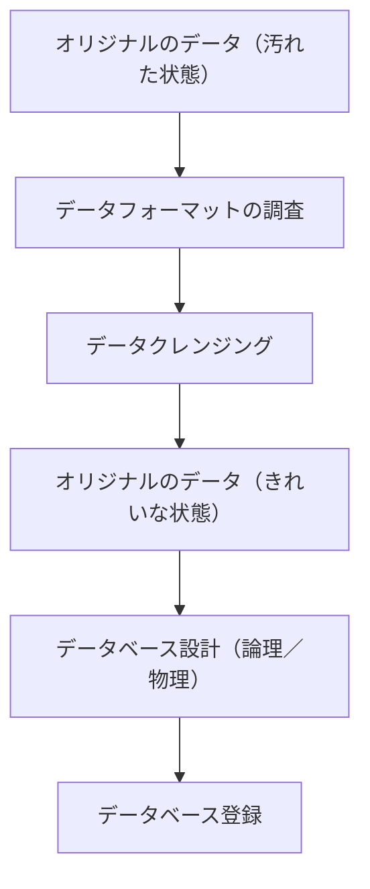
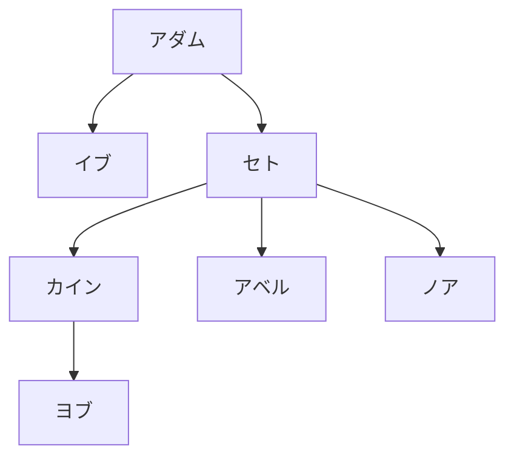

# 達人に学ぶDB設計徹底指南書 第2版

## 第1章　データベースを制する者はシステムを制す

### 1-1 システムとデータベース

- データベースを使わないシステムは、この世に存在しない。
  - データベース（DB:Database）：「データの集まり」を指す
  - DBMS（Database Management System）：データベースを管理するためのシステム
- データと情報
  - データ：ある形式（フォーマット）に揃えられた事実
  - 情報：データと文脈を合成して生まれる

### 1-2 データベースあれこれ

- データベースの代表的なモデル
  1. リレーショナルデータベース（RDB:Relational Database）
     - 最も広く利用されているデータベース
     - 二次元表の形式で管理
     - 本書の対象となるデータベース
  2. オブジェクト指向データベース（OODB:Object Oriented Database）
     - データと操作をまとめたオブジェクトを保存する
  3. XMLデータベース（XMLDB:XML Database）
     - XML形式のデータを扱うデータベース
  4. キー・バリュー型ストア（KVS:Key-Value Store）
     - データを識別キー（key）と値（Value）の組み合わせだけの単純なデータ型で表現するデータベース
     - 大量データを高速に処理するのに適する
  5. ドキュメント型データベース
     - JSON（JavaScript Object Notation）データ構造でデータを保尊する
  6. 階層型データベース（hierarchical Database）
     - データを木構造で表現するデータベース
     - RDBの普及で現在は利用されていない
- データベースのモデルが異なれば、データフォーマットも異なる。モデルが異なれば設計技法も異なる。
- RDBMSの代表例
  1. Oracle Database（Oracle社：有償）
  2. SQL Server（Microsoft者：有償）
  3. Sb2（IBM社：有償）
  4. PostgreSQL（OSS）
  5. MySQL（OSS）
- RDBMSの違いと設計技法の関係
  - RDBMSが異なっても、設計の方法は影響を受けない
  - ただし、RDBMSの機能の違いによる影響は存在する
  
### 1-3 システム開発の工程と設計

- システム開発の設計工程
  1. 要件定義：システムが満たすべき機能やサービスの水準、要件を決める工程
  2. 設計：定義された要件を満たすための設計（デザイン）を行う工程
  3. 開発（実装）：設計書に従ってシステムを実装する工程
  4. テスト：実用に耐えうる品質であるかを試験（テスト）する工程
- 設計工程と開発モデル
  1. ウォーターフォールモデル
     - 要件定義 → 設計 → 開発 → テストを1回、上流から下流に進む
  2. アジャイルモデル
     - 小さな開発サイクル（スプリント）を何度も回す

### 1-4 設計工程とデータベース

- データベースの設計が重要な理由
  - システムにおいて大半のデータは、データベース内に保存される
  - データ設計がシステムの品質を大きく左右する
- データ設計のアプローチ
  - データ中心アプローチ（DOA:Data Oriented Approach）
    - 現在の主流
    - データを一元管理できる
  - プロセス中心アプローチ（POA:ProcesS Oriented Approach）
    - 時代遅れで採用されていない
- 3層スキーマモデル
  1. 外部スキーマ（外部モデル）＝ビューの世界
     - ユーザーから見たデータベース
     - データベースが持つ機能とインターフェースの定義
  2. 概念スキーマ（論理データモデル）＝テーブルの世界
     - 開発者から見たデータベース
     - データベースに保持する要素、データ同士の関係を記述
  3. 内部スキーマ（物理データモデル）＝ファイルの世界
     - DBMSから見たデータベース
     - 具体的にどのようにDBMS内部に格納するかを定義
- 概念スキーマとデータの独立性
  - 概念スキーマがないと変更に対する柔軟性がなくなる
  - 緩衝材
    - 外部スキーマからの論理的データ独立性
    - 内部スキーマからの物理的データ独立性

## 第2章　論理設計と物理設計

### 2-1 概念スキーマと論理設計

- 論理設計：概念スキーマを定義する設計
- 論理設計のステップ
  1. エンティティの抽出
  2. エンティティの定義
  3. 正規化
  4. ER図の作成
- エンティティの抽出
  - エンティティ＝実態
  - システムにどのようなエンティティ（データ）が必要となるかを抽出する
- エンティティの定義
  - データを属性（Attribute）という形で保持する
  - 2次元表の列を定義する
  - 特にキー（key）という列を定義することが重要
- 正規化（Normalization）
  - システムでエンティティの利用がスムーズに行えるように整理
- ER図（Entity-Relationship Diagram）の作成
  - エンティティ同士の関係を表現する図を作成する

### 2-2 内部スキーマと物理設計

- 物理設計：DBMSの物理的なアーキテクチャの設計
- 物理設計のステップ
  1. テーブル定義
  2. インデックス定義
  3. ハードウェアのサイジング
  4. ストレージの冗長構成決定
  5. ファイルの物理配置決定
- テーブル定義
  - DBMS内にテーブルを作成
- インデックス定義
  - インデックス（索引）を作成する
- ハードウェアのサイジング
  - 性能問題のほとんどは、「ストレージのI/Oネック」で発生
  - 正規化による整合性 ←→ パフォーマンス は、強いトレードオフ
  - 予算は、決める要因の中でも重要
  1. キャパシティのサイジング
     - システムで利用するデータ量
     - サービス終了時のデータ増加量
     - ポイント
       1. 安全率を大きくとって、余裕を持たせたサイジングを行う
       2. 容量が不足した場合に簡単に記憶装置を追加できるような構成にしておく（オンプレミス）
       3. クラウドを利用することで、ストレージ容量容量を漸増していく
  2. パフォーマンスのサイジング
     - 性能要件
       1. 応答時間（レスポンス）
       2. スループット（TPS）時間当たりの仕事量
          - DBでは、単位時間当たりのクエリ数：QPSを使うケースもある
     - リソース使用量の基礎数値
       1. 類似の稼働中システムのデータを流用する
       2. 開発の初期段階でプロトタイプシステムを構築して、性能試験を実施する
     - 制度の高いサイジングは難しい
       - 必ず実施時には安全率をかけること
       - スケーラビリティの高い構成を組むこと
- ストレージの冗長構成
  - RAID:Redundant Array Independent Disks
    - 独立したストレージの冗長配列
  1. RAID0（ストライピング）
     - データを異なるディスクに分散して保持
  2. RAID1（ミラーリング）
     - 2本で同一のデータを保持
  3. RAID5（パリティ分散）
     - 誤り符号を分散して格納するので、1本までの故障ならデータの復元が可能
  4. RAID10（RAID0 + 1）
     - RAID0とRAID1の良いとこどりだが、コストは高い
  5. RAID6（パリティ以外にもう一つの冗長データを分散して持つ）
     - RAID5より信頼性が高い
  - どのRAIDパターンを採用するか
    - 少なくともRAID5で構成
    - 予算の余裕があれば、RAID6かRAID10で構成する
- データベースファイルの物理配置
  1. データファイル
     - データを保持するためのファイル
  2. インデックスファイル
     - インデックスを保持するためのファイル
  3. システムファイル
     - DBMSの内部管理用ファイル
  4. 一時ファイル
     - DBMS内部での一時的なデータを格納するファイル
  5. ログファイル
     - データ変更の記録を残すファイル（ログ書き込み後にデータが変更される）
     - ログファイルの名称
       - Oracle、MySQL：REDOファイル
       - SQL Server、Db2、PostgreSQL：トランザクションログ

|ファイル|用途|ユーザーからのアクセス|データ量の継続的な増加|性能レベルの考慮|
|---|---|---|---|---|
|データファイル|テーブルデータの格納|有（テーブル経由）|有|高|
|インデックスファイル|インデックスの格納|有（インデックス経由）|有|高|
|システムファイル|管理用データの格納|原則として無（DBAのみ有）|無|低|
|一時ファイル|一時データの格納|無|無|高|
|ログファイル|更新ログの格納|無|無|中|

### 2-3 データベース単位の冗長構成- レプリケーション

- レプリケーション
  - RAIDより高次での冗長化、可用性の担保ができる
  - 現用系と待機系を用意し、現用系から待機系へデータをコピーする技術
  - 現用系に障害があった場合に待機系に切り替え　る
- レプリケーションの方式
  1. 同期レプリケーション
     - 現用系、待機系のデータ更新を待つ＝性能低下
  2. 非同期レプリケーション
     - 現用系のみのデータ更新を待つ＝信頼性低下
- リードレプリカによる負荷分散
  - 待機系でも読み込み処理のみ受け付けることでパフォーマンスを改善
  - LAMP（Linux/Apache/MySQL/PHP）構成で利用（WordPressなど）

### 2-4 クラウドにおけるデータベースの冗長構成

- クラウドでは、複数の離れた場所に分散配置することで可用性の向上を図っている
- マルチAZ構成（AWS）- レプリケーション
  - 離れた場所にデータベースを分散して持つ
- マルチリージョンによる可用性向上 - 災害対策（DR：ディザスタリカバリー）
  - リージョン全体が被災する広域災害対応 → マルチリージョン構成
- クロスリージョンレプリケーション

|機能|RTO|RPO|コスト|スコープ|
|---|---|---|---|---|
|自動バックアップ|グッド|ベター|低|単一リージョン内|
|手動スナップショット|ベター|グッド|中|異なるリージョン間|
|リードレプリカ|ベスト|ベスト|高|異なるリージョン間|

### 2-5 クラウドはいつどんな時利用するべきなのか

- クラウドのメリット・デメリット
  - メリット
    - 初期費用（イニシャルコスト）が低い
    - リソース増強が簡単
    - 運用のための保守要員が不要
    - データ分散による耐障害対策が容易
  - デメリット
    - ソフトウェアのカスタマイズがきかない
    - 他のオンプレミシステムとの連携が難しい
    - コストが増える可能性がある
    - セキュリティ対策に柔軟性がない
    - 開発時に実施が難しい障害試験がある
    - クラウド障害の場合にはエンドユーザーがやれることがない

### 2-6 バックアップ設計

- バックアップの基本分類
  1. フルバックアップ（完全バックアップ）
     - システムの全てのデータをバックアップ
     - 欠点
       1. バックアップに時間がかかる
       2. ハードウェアリソースへの負荷が高い
       3. ストレージ容量の消費が大きい
  2. 差分バックアップ
     - 差分（ログファイル）を保存
     - フルバックアップ＋差分バックアップがバランスが良い
  3. 増分バックアップ
     - 差分バックアップのより効率化版
     - フルバックアップ＋毎日の増分バックアップ（ログファイル）を保管

```Mermaid
flowchart LR
    a[バックアップ]-->b[フルバックアップ]
    a-->c[差分バックアップ]
    c-->d[差分バックアップ]
    c-->e[増分バックアップ]
```

|名称|フルバックアップ|差分バックアップ|増分バックアップ|
|バックアップ対象データ|すべて|前回のフルバックアップからの差分|前回のバックアップからの差分|
|バックアップのトータル処理時間|大|中|小|
|リカバリーのトータル処理時間|小|中|大|
|メリット|運用が簡単、1つのファイル|中間的、2つのファイル|ファイルサイズが小さい|
|デメリット|リソース負荷大、長い||すべてのファイルが必要、RTOは最低|

- どんなバックアップ方式を採用すべきか？
  1. バックアップしない（バックアップ以外の復旧手段がある場合）
  2. フルバックアップのみ
  3. フルバックアップ＋差分バックアップ
  4. フルバックアップ＋増分バックアップ

### 2-7 リカバリ設計

- リカバリとリストア
  - リストア：バックアップファイルを戻す
  - リカバリ：ログを適用して変更分を反映する
- リストアとロールフォワード
  1. フルバックアップのファイルをデータベースに戻す：リストア
  2. 差分（増分）バックアップしていたログを適用する：リカバリ
  3. データベースサーバーに残っているログを適用する：ロールフォワード
  - RTO（Recovery Time Objective：目標復旧時間）を満たすことが可能かどうか

## 第3章　論理設計と正規化～なぜテーブルは分割する必要があるのか？

### 3-1 テーブルとは何か？

- 二次元表 ≠ テーブル
- テーブル
  - 共通点を持ったレコードの集合である
  - テーブル名はすべて複数形または集合名詞で書ける

### 3-2 テーブルの構成要素

- 行と列
- キー
  - 主キー（プライマリーキー：primary key）
    - 一意性（unique）
    - 複数列の組み合わせ：複合キーも可能
  - 外部キー（foreign key）
    - 二つのテーブルの列同士で設定する（参照整合性制約）
    - 外部キーは親子関係
    - 削除は子 → 親の順番で行う
- 制約
  1. NOT NULL 制約：空欄（NULL）不可
  2. 一意制約：重複不可
  3. CHECK制約：何らかの値の制約
- テーブルと列の名前
  - ルール1：名前に使える文字集合
    - 半角のアルファベット
    - 半角の数字
    - アンダーバー
  - ルール2：最初はアルファベット
  - ルール3：名前は重複してはならない
    - ドメイン（スキーマ）が変われば同じ名前を使用可能

### 3-3 正規化とは何か？

- 正規化（Normalization）によって、正規形（Normal Form）が作られる
- 正規形の定義
  - データベースで保持されるデータの冗長性を排除し、一貫性と効率性を保持するためのデータ形式

### 3-4 第1正規形

- 非正規形

  |社員ID|社員名|子|
  |---|---|---|
  |000A|加藤|達夫／信二|
  |000B|藤本||
  |001F|三島|敦／陽子／清美|

- 第一正規形（1）

  |社員ID|社員名|子1|子2|子3|
  |---|---|---|---|---|
  |000A|加藤|達夫|信二||
  |000B|藤本||||
  |001F|三島|敦|陽子|清美|

- 第一正規形（2）

  |社員ID|社員名|子|
  |---|---|---|
  |000A|加藤|達夫|
  |000A|加藤|信二|
  |000B|藤本||
  |001F|三島|敦|
  |001F|三島|陽子|
  |001F|三島|清美|

- 第一正規形の定義 ～スカラ値の原則
  - 一つのマスには、単一の値しか含まない
- なぜ複数の値を入れてはダメなのか？
  - 関数従属性（Functional dependency）：YはXに従属する ＝ 一意性

### 3-5 第2正規形～部分関数従属

- 第1正規形

  |会社コード|会社名|社員ID|社員名|年齢|部署コード|部署名|
  |---|---|---|---|---|---|---|
  |C0001|A商事|000A|加藤|40|D01|開発|
  |C0001|A商事|000B|藤本|32|D02|人事|
  |C0001|A商事|001F|三島|50|D03|営業|
  |C0002|B化学|000A|斉藤|47|D03|営業|
  |C0002|B化学|009F|田島|25|D01|開発|
  |C0002|B化学|010A|渋谷|33|D04|総務|

  - 主キー：会社コード、社員ID
  - 部分従属関数：会社コード → 会社名

- 第2正規形：テーブル内で部分従属関数を解消し、完全関数従属のみのテーブルを作ること
  - 異なるレベルの実体（エンティティ）を、きちんとテーブルとしても分離する
  - 社員テーブル

    |会社コード|社員ID|社員名|年齢|部署コード|部署名|
    |---|---|---|---|---|---|
    |C0001|000A|加藤|40|D01|開発|
    |C0001|000B|藤本|32|D02|人事|
    |C0001|001F|三島|50|D03|営業|
    |C0002|000A|斉藤|47|D03|営業|
    |C0002|009F|田島|25|D01|開発|
    |C0002|010A|渋谷|33|D04|総務|

  - 会社テーブル

    |会社コード|会社名|
    |---|---|
    |C0001|A商事|
    |C0002|B化学|

- 第2正規形でないと何が悪いのか？
  - 社員が不明の会社（C建設）が追加できない
  - 「C0001,A商事」、「C0001,A商社」と間違ったデータが登録されてしまう可能性がある
- 無損失分解と情報の保存
  - 第2正規化は可逆的な操作
  - 非正規形 ←→ 正規形：結合で非正規形に戻る

### 3-6 第3正規形～推移的関数従属

- 第2正規形
  - 社員テーブル

    |会社コード|社員ID|社員名|年齢|部署コード|部署名|
    |---|---|---|---|---|---|
    |C0001|000A|加藤|40|D01|開発|
    |C0001|000B|藤本|32|D02|人事|
    |C0001|001F|三島|50|D03|営業|
    |C0002|000A|斉藤|47|D03|営業|
    |C0002|009F|田島|25|D01|開発|
    |C0002|010A|渋谷|33|D04|総務|

  - 会社テーブル

    |会社コード|会社名|
    |---|---|
    |C0001|A商事|
    |C0002|B化学|

- 推移的関数従属
  - 部署コード → 部署名（関数従属）
  - 会社コード,社員ID → 部署コード（関数従属）
  - 会社コード,社員ID → 部署コード → 部署名（推移的関数従属）

- 第3正規形：テーブルを分割することで、それぞれの関数従属の関係を独立させる
  - 社員テーブル

    |会社コード|社員ID|社員名|年齢|部署コード|部署名|
    |---|---|---|---|---|---|
    |C0001|000A|加藤|40|D01|開発|
    |C0001|000B|藤本|32|D02|人事|
    |C0001|001F|三島|50|D03|営業|
    |C0002|000A|斉藤|47|D03|営業|
    |C0002|009F|田島|25|D01|開発|
    |C0002|010A|渋谷|33|D04|総務|

  - 会社テーブル

    |会社コード|会社名|
    |---|---|
    |C0001|A商事|
    |C0002|B化学|

  - 部署テーブル

    |部署コード|部署名|
    |---|---|
    |D01|開発|
    |D02|人事|
    |D03|営業|
    |D04|総務|

### 3-7 ボイス-コッド正規形

- 3次と4次の狭間
  - ボイスーコッド正規形（Boyce-Codd normal form）
    - 第三正規形をより厳密にしたもの

- ボイスーコッド正規形を満たしていないテーブル

  - 社員-チーム・リーダーテーブル

    |社員ID|チームコード|チーム補佐|
    |---|---|---|
    |000A|001|123W|
    |000B|001|456Z|
    |000B|002|003O|
    |001F|001|123W|
    |001F|002|003O|
    |003O|002|999Y|

  - 社員ID,チームコード → チーム補佐
  - チーム補佐 → チームコード
  - 問題点
    1. チーム補佐が担当チームを変える場合に複数行の更新が発生する（データの冗長性）
    2. 社員がチームに参加するまで、チーム補佐とチームの関係を登録できない
    3. 社員がチームから外れたときにレコードを削除すると、チーム補佐とチームの関連も削除される

- ボイスーコッド正規形

  - 非キーからキーへの関数従属をなくした状態

  - 社員-チーム補佐テーブル

    |社員ID|チーム補佐|
    |---|---|
    |000A|123W|
    |000B|456Z|
    |000B|0030|
    |001F|123W|
    |001F|003O|
    |003O|999Y|

  - チーム補佐-チームテーブル

    |チーム補佐|チームコード|
    |---|---|
    |123W|001|
    |456Z|001|
    |003O|002|
    |999Y|002|

  - ありえない組み合わせのレコードも登録可能な状態になるので、アプリケーション側での制御が必要となる

### 3-8 第4正規形

- 第3正規形

  - 社員・チームテーブル

    |社員ID|チームコード|製品|
    |---|---|---|
    |000A|001|P1|
    |000A|001|P2|
    |000B|001|P1|
    |000B|002|P1|
    |001F|001|P2|
    |001F|002|P2|
    |003O|001|P3|

- 多値従属性～キーと集合の対応
  - 社員ID → 複数チーム
  - 社員ID → 複数製品

- 第4正規化を行う
  - 多値従属性が複数存在するテーブルを分割する
  - 社員-チームテーブル

    |社員ID|チームコード|
    |---|---|
    |000A|001|
    |000B|001|
    |000B|002|
    |001F|001|
    |001F|002|
    |003O|001|

  - 社員-製品テーブル

    |社員ID|製品|
    |---|---|
    |000A|P1|
    |000A|P2|
    |000B|P1|
    |001F|P2|
    |003O|P3|

- 第4エンティティの意義
  - 自然な正規形（普通にせっけいすれば、こうなる）
  - 関連エンティティを作る場合は、そこに含まれる関連は1つにする

### 3-9 第5正規形

- 第4正規形
  - 社員-チームテーブル

    |社員ID|チームコード|
    |---|---|
    |000A|001|
    |000B|001|
    |000B|002|
    |001F|001|
    |001F|002|
    |003O|001|

  - 社員-製品テーブル

    |社員ID|製品|
    |---|---|
    |000A|P1|
    |000A|P2|
    |000B|P1|
    |001F|P2|
    |003O|P3|

  - チーム-製品間の従属性が不明

- 第5正規形を行う
  
  - 社員-チームテーブル

    |社員ID|チームコード|
    |---|---|
    |000A|001|
    |000B|001|
    |000B|002|
    |001F|001|
    |001F|002|
    |003O|001|

  - 社員-製品テーブル

    |社員ID|製品|
    |---|---|
    |000A|P1|
    |000A|P2|
    |000B|P1|
    |001F|P2|
    |003O|P3|

  - チーム-製品テーブル

    |チームコード|製品|
    |---|---|
    |001|P1|
    |001|P2|
    |002|P1|
    |002|P2|
    |002|P3|

  - 関連がある場合は、それに対する関連エンティティを作ること

### 3-10 正規化についてのまとめ

- 正規化の三つのポイント
  - ポイント1：正規化とは更新時の不都合／不整合を排除するために行う
  - ポイント2：正規化は従属性を見抜くことで可能になる
  - ポイント3：正規形はいつでも非正規形に戻せる（無損失分解）
- 正規形同士ののレベルの関係
  - 日常で使う表
    - 第1正規形
      - 第2正規形
        - 第3正規形
          - 第4正規形
            - 第5正規形
- 正規化は常にするべきか？
  - 第3正規形までは、原則として行う
  - 関連エンティティが存在する場合は、関連とエンティティが1対1に対応するように注意する
- 正規化
  - メリット1：データの冗長性が排除され、更新時の不整合を防止できる
  - メリット2：テーブルの持つ意味が明確になり、開発者が理解しやすい
  - デメリット：テーブル数が増えるため、SQL文で結合を多用することになり、パフォーマンスが悪化する

## 第4章　ER図～複数のテーブルの関係を表現する

### 4-1 テーブルが多すぎる！

- ER図（Entity-Relationship Diagram：実体関連図）
  - テーブル同士の関連を人間が理解できるようにする
- ER図のフォーマット
  - IE記法（Information Engineering）
  - IDEFIX

### 4-2 テーブル同士の関連を見抜く

- 関連パターン
  1. 1対1：通常は同一テーブルになるので、あまり見かけない
  2. 1対多：正規化によって生まれる関連で最もよくある
  3. 多対多：リレーショナルデータベースのお約束として多対多のテーブルは作ってはいけない

### 4-3 ER図の描き方

- ネット参照

### 4-4 「多対多」と関連実体

- 多対多の例
  - 学生 - 多対多 → 講義
- 関連エンティティ（Associative Entity）
  - 学生 - 受講 - 講義
  - 受講テーブルで学生と講義を紐づける

## 第5章　論理設計とパフォーマンス～正規化の欠点と非正規化

### 5-1 正規化の功罪

- 正規化とSQL（検索）
  - 内部結合を使うケース
  - 外部結合を使うケース
  - 非正規化による解決
- 正規化とSQL（更新）
  - 更新コスト：正規化＜＜非正規化
- 原則として非正規化は許さないというスタンスが良い
- 検索パフォーマンス ←→ データ整合性 のトレードオフで最終決定（非正規化は最後の手段）

### 5-2 非正規化とパフォーマンス

- サマリーデータの冗長性とパフォーマンス
  - 第3正規形を満たさない形のため、更新時に問題が発生することになるが、検索パフォーマンスは良い
- 選択条件の冗長性とパフォーマンス
  - 第2正規形を満たさないが、検索パフォーマンスは良い
- 基本的に正規化は可能な限り高次にすることが大前提

### 5-3 冗長性とパフォーマンスのトレードオフ

- リスク
  1. 非正規化は、検索のパフォーマンスを向上させるが更新のパフォーマンスを低下させる
  2. データのリアルタイム性（鮮度）を低下させる
  3. 後続の工程で設計変更すると、手戻りが大きい
- 更新時のパフォーマンス
  - 商品数などのサマリーデータを追加した場合、サマリーデータの更新処理も必要となる
- データのリアルタイム性
  - 商品数の変更タイミングをどうするか？
- 改修コストの大きさ
  - データモデルの変更 ＞＞ コードベースの変更（DOAの大原則）
  - 論理設計には、物理設計の知識が必要

こ## 第6章　データベースとパフォーマンス

### 6-1 データベースのパフォーマンスを決める要因

- インデックス：［キー値,情報］の配列
- 統計情報：SQLのアクセスパスを決める要因

### 6-2 インデックス設計

- メリット
  1. アプリケーションのコードに影響を与えない（アプリケーション透過的）
  2. テーブルのデータに影響を与えない（データ透過的）
  3. 性能改善の効果が大きい
     - インデックス・ショットガン：テーブルの前列にインデックスを作成するアンチパターン
- インデックスの種類
  - B-treeインデックス
    - 構造：平衡木（Balanced tree）SQL関数を適用している
    - 特徴
      1. 均一性：各キー値の間で検索速度にバラつきが少ない
      2. 持続性：データの増加に比して、パフォーマンス劣化が少ない
      3. 処理汎用性：検索、挿入、更新、削除のいずれの処理もそこそこ速い
      4. 非等値性：等号（＝）に限らず、不等号を使ってもそこそこ速い
      5. 親ソート性：ソートが必要な処理を高速化できる

### 6-3 B-treeインデックスの設計方針

- B-treeインデックスを作る列
  1. 大規模なテーブルに対して作成する
  2. カーディナリティの高い列に作成する
     - 複数列に対して作成する場合は、複数列の組み合わせで考える
  3. SQL文でWHERE句の選択条件、または統合条件に使用されている列に作成する
- B-treeインデックスが効かないSQL文
  1. インデックス列に演算を行っている
  2. インデックス列に対して
  3. IS NULL述語を使っている
  4. 否定形（<>）を用いている
  5. 後方一致、または中間一致のLIKE述語を用いている
  6. 暗黙の型変換を行っている
- B-treeインデックスの注意事項
  1. 主キー、一意制約の列には作成不要
  2. B-treeインデックスは更新性能を劣化させる
  3. 定期的なメンテナンスを行うことが望ましい

### 6-4 統計情報

- 統計情報：メタデータ
- オプティマイザと統計情報
  - パーサー：SQL文の構文チェック
  - オプティマイザ：実行計画の決定 ← 統計情報
  - カタログマネージャ：統計情報を持つ



- 統計情報の設計指針
  1. 統計情報収集のタイミング
     - データが大きく更新された後、なるべく早く
     - リソースを消費するので、システム使用率が低い時間帯に実施する
  2. 統計情報収集の対象（範囲）
     - 大きな変更のあったテーブル
  3. 統計情報の凍結について
     - オプティマイザを信じない悲観的設計。実施するのはかなり大変。

### 6-5 インデックス以外のチューニング手段

- パーティション
  - テーブルにある列をキーとして物理配置をキーごとにまとめ機能
  - パーティショニングテーブル：データの読み込み量を減らせる
  1. パーティションの種類
     - レンジパーティション：順序を持つデータを特定の範囲に分割します（特に時系列）
     - リストパーティション：離散的な値を持つデータを特定の範囲に分割します
     - ハッシュパーティション：キーとなる列の値に従ってデータを分散配置します（カーディナリティが高いキーに有効）
  2. パーティションの注意点
     - WHERE句でパーティションキーを検索条件に指定しないと意味がない
     - パーティションキーに大きな偏りがないこと
     - 複数のパーティションを組み合わせることができる（コンポジット・パーティション）
     - パーティション数の上限がある
- ヒント句
  - DBMSは実行計画を自動でsカウ生する
  - 人間の思うような実行計画に変更できる機能
  - 熟練者の最後の手段
- パラレルクエリ
  - 通常SQL文はシングルコアで処理 → マルチコア化
  - サーバーやストレージ領域のリソースが潤沢に余っているときに有効
  - リソースの限界：他のクエリを巻き添えにデータベース全体が遅延する
  - RDBMSにより機能に差がある
- オンメモリ
  - メモリが潤沢に余っている場合に有効
  - ボトルネックのストレージI/Oを使わない（メモリアクセス）ので高速化
  - RDBMSにより機能に差がある

### ビットマップインデックス

- ビットマップインデックス：データの値からビットデータを作成して、インデックスとして保持
- 利点
  - カーディナリーの低い列に対しても検索性能が良い
  - OR条件でも利用可能
  - インデックスのサイズが小さい
- 欠点
  - 更新時の性能が悪い

### ハッシュインデックス

- ハッシュインデックス：ハッシュ関数を使ってデータの値をハッシュ値に変えてインデックスを保持
- 利点：等値（＝）検索で非常に性能が良い
- 欠点：等値検索以外では利用できない

## 第7章　論理設計のアンチパターン

### 7-1 論理設計の「やってはいけない」

- アンチパターン：やってはいけない設計
- 「戦略の失敗を戦術で取り返すことはできない」：論理設計の失敗を実装では改善できない

### 7-2 非スカラ値（第1正規形未満）

- 配列型による非スカラ値
  - 基本、配列型は使わない
- スカラ値の基準：分解不可能な値
  - 意味的に分割できる限り、なるべく分割して保持する（意味は壊さない）

### 7-3 ダブルミーニング

- 列の意味が途中で変わる：テーブルの列は変数ではない（変更不可）

### 7-4 単一参照テーブル

- 多すぎるテーブルをまとめたい：単一参照テーブル
- 単一参照テーブル：複数のマスタテーブルをひとつのテーブルにまとめたもの
- 利点
  - マスタテーブル数が減り、ER図やスキーマがシンプルになる
  - コード検索のSQLを共通化できるので、保守／管理が容易になる
- 欠点
  - コードタイプ、コード値、コード内容の各列とも必要とされる列長がコード体系によって異なるため、余裕を見て大きめの可変長文字列型で宣言する必要がある
  - コード検索のSQL内でコードタイプやコード値を間違えて指定してもエラーになることがないので、バグに気づきにくい
  - ER図は簡素化されるが、正確さを欠いており、可読性を下げる
  - データテーブル側のコード列とデータ型が異なる可能性が高いため外部キーによる参照整合性制約を付与できない

### 7-5 テーブル分割

- テーブル分割
  1. 水平分割
     - 欠点
         1. 分割する意味的な理由がない（ストレージI/Oの低減目的）
         2. 拡張性に乏しい（テーブルが増えるごとにアプリケーションも改修が必要）
         3. 他の代替手段がある：パーティション
  2. 垂直分割
     - 欠点
         1. 分割する意味的な理由がない（ストレージI/Oの低減目的）
         2. 他の代替手段がある：集約
- 集約
  1. 列の絞り込み
     - 列を絞ったテーブルを新規作成する（データマート）
     - 定期的に動機が必要
  2. サマリテーブル
     - 集約関数によってレコードを集約したテーブルを新規作成する
     - 定期的に動機が必要
- マテリアライズドビュー
  - ビュー：SQLで都度データを取得（パフォーマンス改善はない）
  - マテリアライズドビュー
    - 利点
      - データを保持するのでパフォーマンス改善はある
      - 主キーをはじめとしてインデックスを作成できる
    - 欠点
      - リフレッシュ管理が必要
      - 普通のテーブルと同様にストレージ容量を消費する

### 7-6 不適切なキー

- キー
  - 主キー、外部キーなどデータベース機能で設定されるもの
  - テーブルの結合条件で使用される列（結合キー）
- キーで使ってはいけないデータ型
  - 可変長文字列（VARCHAR）：不変性（Stability）を備えていない
  - 固定長文字列（CHAR）との混同
- 同じデータを意味するキーは同じデータ型にすべし
  - 列同士の比較が穴埋め（バディング）でアンマッチとなる可能性があるため

### 7-7 ダブルマスタ

- 同じ役割のマスタデータが複数テーブルある：複数システムの統合時に発生しやすい
- ダブルマスタはSQLを複雑にし、パフォーマンスを悪化させる
- しっかりデータクレンジング（データ精査）を行う

### 7-8 ゾンビマートと多段マート（Data Ware House）

- データマート：大規模データから切り出した小規模テーブル
- データマートの必要性
  - ユーザーの利便性
  - パフォーマンス
- ゾンビマート：使われなくなったのに削除されておらず、怖くて削除できないデータマート
- 多段マート：データマートの組み合わせで作成されたデータマート

## 第8章　論理設計のグレーノウハウ

### 8-1 違法すれすれの「ライン上」に位置する設計

- グレーノウハウ
  - 利点、欠点を正確に把握して節度ある使用が必要

### 8-2 代理キー～主キーが役に立たないとき

- 主キーが決められない、主キーとして不十分なケース
  1. そもそも入力データに主キーにできるような一意キーが存在しない
  2. 一意キーはあるが、サイクリックに使いまわされる
  3. 一意キーはあるが、途中で指す対象が変化する
- 代理キーによる解決
  - 代理キー（Surrogate Key）：新たなキーとして追加
  - 一般的な原則としては、代理キーの使用は避ける
  - 論理的に不要なキー → ER図の可読性をさげる
- 自然キーによる解決
  - タイムスタンプ：年度等の情報を追加
  - インターバル：開始と終了の情報を追加
- 代理キーを使う場合：オートナンバリングの是非
  - 重複値が生じないこと（一意性の保証）
  - 歯抜けが生じないこと（連続性の保証）
- オートナンバリング
  1. データベース機能
     1. シーケンスオブジェクト：RDBMSにより非サポートの場合がある
     2. ID列：RDBMSごとに異なり、移植性が低い（MySQL以外はシーケンスオブジェクトを使う）
  2. アプリケーション側で実装：車輪の再発明なので基本はやらない
     1. プログラムの開発とテストにコストがかかる
     2. ER図で依存関係が不明

### 8-3 列持ちテーブル

- 配列型は使えない、でも配列を表現したい
- 列持ちテーブル
  - 利点
    1. シンプルな設計
    2. 入出力のフォーマットと合わせやすい
  - 欠点
    1. 列の増減が難しい
    2. 無用のNULLを使わなくてはならない

  |社員ID|社員名|子1|子2|子3|
  |---|---|---|---|---|
  |000A|加藤|達夫|信二||
  |000B|藤本||||
  |001F|三島|敦|陽子|清美|

- 行持ちテーブル：基本的にはこちらで対応すべき

  |社員ID|枝番|子|
  |---|---|---|
  |000A|1|達夫|
  |000A|2|信二|
  |001F|1|敦|
  |001F|2|陽子|
  |001F|3|清美|

### 8-4 アドホックな集計キー

- アドホック：その場限りの
- 集計キー（地方コード付き）

  |県コード|県名|人口|地方コード|
  |---|---|---|---|
  |01|北海道|550|01|
  |02|青森|130|01|
  |03|岩手|133|01|
  |22|静岡|370|02|
  |23|愛知|740|02|
  |24|三重|185|02|
  |36|徳島|78|03|
  |37|香川|99|03|

- 解決策1：キーを別テーブルに分離する

  |県コード|地方コード|
  |---|---|
  |01|01|
  |02|01|
  |03|01|
  |22|02|
  |23|02|
  |24|02|
  |36|03|
  |37|03|

- 解決策2：ビューを使う
- GROUP BY句の中でアドホックキーを作る

### 8-5 多段ビュー

- ビューへのアクセスは2段階で行われる



- 多段ビューの危険性
  - SELECT文が増えてパフォーマンスを悪化させる可能性が高い

### 8-6 データクレンジングの重要性

- データクレンジング（Data Cleansing）：データベースに登録できる状態にすること
- データクレンジングは設計に先立って行う



- 代表的なデータクレンジングの内容
  - 一意キーの特定
  - 名寄せ：似通った名前を寄せ集めて統合する
    - 他のデータも利用して名寄せを行う

## 第9章　一歩進んだ論理設計～RDBで木構造を扱う

### 9-1 リレーショナルデータベースのアキレス腱

- 木構造とは
  - ノード（node）：木の結節点（人名）
  - ルートノード（root node）：木が始まるトップのノード。アダム
  - リーフノード（leaf node）：自分より下位のノードを持たない。イブ、ヨブ、アベル、ノア
  - 内部ノード（Inner node）：中間ノード。セト、カイン
  - 経路（path）：ノードからノードへたどる経路



### 9-2 古くて新しい解法～隣接リストモデル

- 組織図

  |emp（社員）|boss（上司）|
  |---|---|
  |アダム||
  |イブ|アダム|
  |セト|アダム|
  |カイン|セト|
  |アベル|セト|
  |ノア|セト|
  |ヨブ|カイン|

- 再帰共通表式（Recursive Common Table Expression：再帰CTE）のサポート
  - WITH句で定義したテーブルを自己参照することで記述する
- 隣接リストモデルが大規模な木構造を扱えるかはまだ未知数
- 隣接リストモデルにおける更新
  - 内部ノードの削除：関係するノードのみ更新すればよい
  - ノードの挿入：関係するノードのみ更新すればよい

### 9-3 閉包テーブルモデル

- 閉包テーブルモデル（Closure Table Model）：2つのテーブルを使用する

  - OrgChart

    |emp（社員）|role（役職）|tree id|
    |---|---|---|
    |アダム|社長|1|
    |イブ|部長|2|
    |セト|部長|3|
    |カイン|課長|4|
    |アベル|課長|5|
    |ノア|課長|6|
    |ヨブ|ヒラ|7|

  - Closure

    |parent（親）|child（子）|
    |---|---|
    |1|1|
    |1|2|
    |1|3|
    |1|4|
    |1|5|
    |1|6|
    |1|7|
    |2|2|
    |3|3|
    |3|4|
    |3|5|
    |3|6|
    |3|7|
    |4|4|
    |4|7|
    |5|5|
    |6|6|
    |7|7|

- 閉包テーブルモデルによる検索
  - 検索は非常にシンプルで容易
- 閉包テーブルモデルによる更新
  - 更新は難しくはないが、やや面倒

### 9-4 どちらを使うべきか

1. 隣接リストモデル
2. 閉包テーブルモデル
